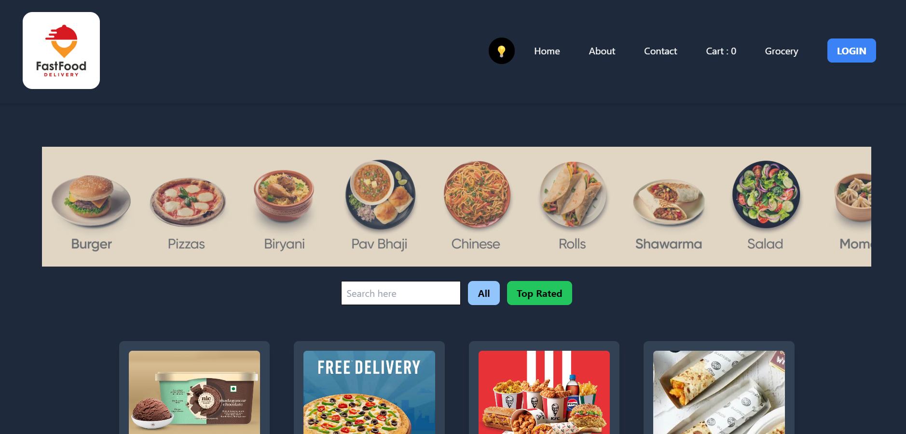

## Food Ordering Website

## Screenshot

 

Food Ordering Website is a dynamic web application built with ReactJS and Tailwind CSS. This project provides a user-friendly interface for browsing food menus, placing orders, and managing customer accounts. The application features a modern design, efficient build processes, and robust performance optimizations.

## Features

- **Header Navigation**  
  Easy-to-use navigation bar for accessing different parts of the application.

- **User Authentication**  
  - Sign Up / Sign In Forms
  - Form Validation
  - Firebase Integration
  - Firebase Deployment

- **Redux State Management**  
  - User Slice
  - Sign-Out Feature
  - Profile Update
  - Bug Fixes

- **Food Menu Management**  
  - Browse Menu Items
  - Add to Cart
  - Checkout Process

- **Order Management**  
  - View Order History
  - Track Order Status

- **Multi-Language Support (BONUS FEATURE)**  
  Support for multiple languages to cater to a diverse user base.

- **Performance Optimization**  
  - Memoization
  - Responsiveness
  - Support for Small Devices

## Technologies Used

- **ReactJS**: `npm install react --save`  
  A JavaScript library for building user interfaces.

- **Tailwind CSS**: `npm install tailwindcss --save`  
  A utility-first CSS framework for modern web design.

## Dev Build with Parcel

Our project uses **Parcel** as the bundler for an efficient development and production build process. Here are the key features and processes supported by Parcel:

- **Local Server**  
  Parcel provides a local development server to serve your files and enable real-time development.

- **HMR (Hot Module Replacement)**  
  Hot Module Replacement allows you to see changes instantly without needing a full page reload.

- **File Watching Algorithm**  
  Parcel uses a file-watching algorithm written in C++ for efficient detection of file changes.

- **Caching**  
  Caching mechanisms are implemented to speed up build processes by storing intermediate build results.

- **Image Optimization**  
  Parcel optimizes images for better performance and faster load times.

- **Minification**  
  Automatically minifies JavaScript and CSS files to reduce their size for production.

- **Bundling**  
  Combines multiple files into a single bundle for optimized performance and reduced number of requests.

- **Compress**  
  Compresses files to minimize their size and improve load times.

- **Consistent Hashing**  
  Ensures even distribution of data across servers, improving build performance and reliability.

- **Code Splitting**  
  Breaks code into smaller chunks to improve load times and performance.

- **Differential Bundling**  
  Supports older browsers with different bundles for compatibility.

- **Diagnostics**  
  Tools for monitoring and debugging issues during development.

- **Error Handling**  
  Manages and reports errors effectively for a smoother development experience.

- **HTTPS**  
  Ensures secure data transmission for both development and production environments.

- **Tree Shaking**  
  Removes unused code from the final bundle to reduce file sizes.

- **Different Dev and Production Bundles**  
  Separate bundles for development and production environments for optimized performance.